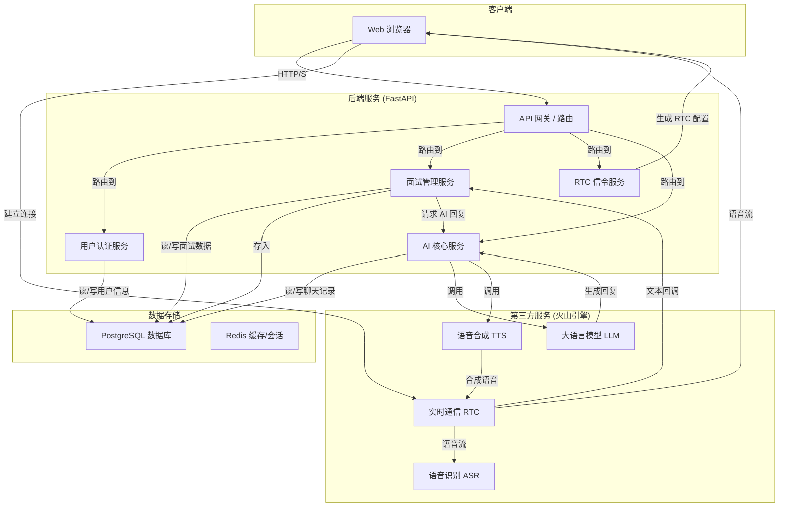

# AI 语音面试平台技术设计文档

## 1. 项目概述

本项目是一个基于 FastAPI 开发的 AI 语音面试 Web 应用。它旨在通过模拟真实的面试场景，帮助求职者提升面试技巧。平台的核心功能是利用先进的第三方服务，包括字节跳动火山引擎提供的实时语音识别（ASR）、语音合成（TTS）以及大型语言模型（LLM），为用户提供高度智能和互动的面试体验。

用户可以上传自己的简历，系统将对简历进行深度分析，并根据其内容（如求职意向、过往经历）自动生成一场定制化的模拟面试。在面试过程中，AI 面试官会通过语音与用户进行实时对话。面试结束后，系统会根据对话内容生成一份全面的评估报告，为用户提供有价值的反馈。

### 1.1. 技术栈

-   **后端框架**: FastAPI
-   **数据库**: PostgreSQL (使用 SQLAlchemy Core 和 Alembic 进行迁移管理)
-   **实时通信与AI**: 字节跳动火山引擎 (RTC, ASR, TTS, LLM)
-   **容器化**: Docker, Docker Compose
-   **认证**: JWT (JSON Web Tokens)

---

## 2. 系统架构

本平台采用经典的分层架构，确保了各组件之间的低耦合和高内聚。核心后端服务作为总指挥中心，负责协调用户请求、管理业务逻辑、与数据库交互以及编排第三方 AI/RTC 服务。

### 2.1. 架构图

### 2.2. 组件职责

-   **客户端**: 任何支持现代 Web 技术的浏览器，负责UI渲染和与后端API的交互。
-   **后端服务 (FastAPI)**:
    -   **API 网关**: 接收客户端请求，并根据 URL 路由到相应的服务。
    -   **用户认证服务**: 处理用户注册、登录、密码重置和会话管理。
    -   **面试管理服务**: 核心业务逻辑，包括简历上传、面试创建、状态管理、结果评估等。
    -   **RTC 信令服务**: 与火山引擎 RTC 服务对接，生成认证 Token 和详细的场景配置。
    -   **AI 核心服务**: 封装与 LLM 的交互，用于简历分析、面试问题生成和最终评估。
-   **数据存储**:
    -   **PostgreSQL**: 持久化存储所有核心业务数据，如用户信息、面试记录、聊天日志等。
    -   **Redis**: (当前为内存缓存，可扩展为Redis) 用于实现请求频率限制和管理临时数据。
-   **第三方服务 (火山引擎)**: 项目的核心驱动力，提供 AI 和实时通信能力。

---

## 3. 核心用户流程

### 3.1. 用户注册与认证流程

1.  **发送验证码**: 用户输入邮箱，后端调用 `/users/send-verification-code`，生成验证码，存入数据库并发送邮件。
2.  **用户注册**: 用户提交邮箱、密码和验证码至 `/users/register`。后端校验验证码和密码强度后，创建用户记录。
3.  **用户登录**: 用户通过 `/users/login` 使用密码或邮箱验证码登录。
4.  **令牌获取**: 登录成功后，后端生成 JWT，返回给客户端。客户端在后续请求的 Header 中携带此 Token 进行认证。

### 3.2. AI 面试发起流程

1.  **上传简历**: 认证用户通过 `/chat/upload-file` 上传简历文件 (PDF/DOCX)。
2.  **简历分析**: 后端接收文件，提取文本内容，然后调用火山引擎 LLM 分析简历，提取求职意向、经验总结等关键信息，并创建一场新的 `Interview` 记录。
3.  **获取 RTC 配置**: 客户端请求 `/rtc/getScenes`，并附带上一步生成的 `task_id` 和简历分析结果。
4.  **场景配置生成**: 后端根据简历信息和预设的 Prompt 模板，动态生成一个复杂的 JSON 对象，包含了 ASR、TTS、LLM 及回调服务器的全部配置。
5.  **启动面试**: 客户端拿到 RTC 配置后，调用 `/rtc/startVoiceChat` 通知后端面试正式开始。后端将 `Interview` 状态更新为 `START_INTERVIEW`。

### 3.3. 实时面试交互流程

1.  **建立连接**: 客户端使用从 `/rtc/getToken` 获取的 Token 和 `/rtc/getScenes` 获取的配置初始化 RTC SDK，与火山引擎建立连接。
2.  **语音对话**:
    -   用户说话，语音流被发送到火山 RTC 服务。
    -   RTC 服务将语音流实时转发给 ASR 服务进行识别。
    -   ASR 识别出文本后，通过 Webhook 回调后端的 `/chat/chat_callback` 接口。
3.  **后端处理回调**:
    -   后端接收到文本，记录用户对话到 `ChatLog` 表。
    -   检查用户积分，如果不足则中断面试。
    -   将用户的回答和对话历史一起发送给 LLM 获取面试官的下一句回复。
4.  **AI 回复**:
    -   LLM 生成回复文本。
    -   后端调用 TTS 服务将文本合成为语音。
    -   合成的语音流通过 RTC 服务传回给客户端播放。
    -   同时，后端将 AI 的回复也记录到 `ChatLog` 表。

### 3.4. 面试结果生成与获取流程

1.  **结束面试**: 用户主动点击结束，或面试达到45分钟上限，客户端调用 `/rtc/stopVoiceChat`，或后端在回调中自动触发。
2.  **状态更新**: 后端将 `Interview` 状态更新为 `INTERVIEW_COMPLETED`。
3.  **获取结果**: 用户请求 `/chat/detail/interview_result/{task_id}`。
4.  **生成报告**:
    -   后端检查面试时长和状态。
    -   从 `ChatLog` 表中组装完整的对话记录。
    -   将完整对话记录和预设的评估 Prompt 一起发送给 LLM 进行综合评分和分析。
    -   将 LLM 返回的 JSON 格式评估结果更新到对应 `Interview` 记录的 `interview_result` 字段中。
5.  **返回结果**: 后端将格式化后的面试结果返回给客户端。

---

## 4. API 端点详解

### 4.1. 用户认证 (`/users`)

-   `POST /send-verification-code`: 发送注册邮箱验证码。
-   `POST /send-login-code`: 发送登录邮箱验证码。
-   `POST /register`: 使用邮箱和验证码注册新用户。
-   `POST /login`: 核心登录接口，支持密码和验证码两种模式。返回 JWT。
-   `POST /forgot-password`: 忘记密码，发送重置链接。
-   `POST /reset-password`: 使用 Token 重置密码。
-   `GET /me`: 获取当前登录用户的个人信息。
-   `PUT /me`: 更新当前登录用户的个人信息。

### 4.2. 面试与聊天 (`/chat`)

-   `POST /upload-file`: 上传简历，触发简历分析并创建面试。
-   `GET /list/interview_result`: 获取当前用户的所有面试结果列表。
-   `GET /list/chatlog/{task_id}`: 获取指定面试的聊天记录。
-   `GET /detail/resume/{task_id}`: 获取简历的 AI 分析结果。
-   `GET /detail/interview_result/{task_id}`: 获取指定面试的最终评估报告。
-   `POST /chat_callback`: **核心内部接口**，接收来自火山 RTC 服务的实时语音转文本回调。

### 4.3. 实时通信 (`/rtc`)

-   `GET /getToken`: 获取加入 RTC 房间所需的认证 Token。
-   `POST /getScenes`: 获取 RTC 的详细场景配置，包括 ASR, TTS, LLM 等。
-   `POST /startVoiceChat`: 通知后端开始一场语音面试。
-   `POST /stopVoiceChat`: 通知后端停止一场语音面试。

---

## 5. 数据库模型

项目使用 SQLAlchemy ORM 进行数据建模。

-   **User (`models.user.User`)**: 存储用户信息，包括邮箱、哈希后的密码、积分、是否激活等。
-   **Interview (`models.interview.Interview`)**: 核心模型，记录每场面试的状态、任务ID、关联用户、时长、以及最终的 JSON 格式评估结果。
-   **ChatLog (`models.chat_log.ChatLog`)**: 记录面试过程中的每一条对话，包括消息内容、发送者（用户或AI）、关联的任务ID等。
-   **EmailVerification (`models.email_verification.EmailVerification`)**: 存储邮箱验证码及其过期时间。
-   **PasswordReset (`models.password_reset.PasswordReset`)**: 存储密码重置 Token 及其有效性。
-   **UserFile (`models.user_file.UserFile`)**: 记录用户上传的文件信息，包括原始文件名、路径和提取的文本内容。

---

## 6. 认证与授权

-   **认证机制**: 系统采用基于 JWT 的无状态认证。用户登录后获得一个 access_token，后续所有需要认证的请求都必须在 `Authorization` Header 中以 `Bearer <token>` 的形式提供该令牌。`app.api.deps` 中的 `get_current_user` 依赖项负责解码和验证令牌。
-   **密码安全**: 用户密码在存入数据库前，会通过 `app.core.security.get_password_hash` 函数进行加盐哈希处理，确保明文密码不会被存储。
-   **授权控制**: 项目实现了基于积分的访问控制。在 `app.api.deps.require_points` 依赖中，会检查用户的积分是否足够发起或继续面试。这是一个简单的功能级授权实现。

---

## 7. 核心服务与业务逻辑

-   **CRUD 操作 (`app/crud`)**: 遵循关注点分离原则，所有直接的数据库操作（增、删、改、查）都被封装在 `crud` 目录下的各个模块中。例如，`crud.user` 负责所有与 `User` 模型相关的数据库交互。
-   **服务层 (`app/services`)**:
    -   `auth.py`: 封装了认证策略，如验证密码、验证邮箱验证码等。
    -   `email.py`: 负责发送各种类型的邮件（验证码、密码重置链接）。
    -   `zijie/`: 存放与火山引擎服务交互的底层逻辑。`sig.py` 负责生成 API 请求签名，`rtc_callback.py` 负责解析回调消息，`genToken.py` 用于生成 RTC 的 Access Token。

---

## 8. AI与提示工程

-   **AI 模型**: 项目依赖火山引擎的 LLM 服务，通过其 API `https://ark.cn-beijing.volces.com/api/v3` 进行调用。具体的模型端点ID在代码中配置。
-   **提示(Prompt)管理**: 所有与 LLM 交互的提示都存放在 `prompt/` 目录下，按用途（`resume_prompt`, `interview`, `ranking`）分文件管理。
-   **动态提示加载**: `app/utils/prompt_loader.py` 提供了一个工具，可以使用 Jinja2 模板引擎动态加载和格式化提示。这使得可以方便地将上下文信息（如简历内容、对话历史）注入到提示中，从而生成更精准的 AI 指令。

---

## 9. 配置与环境

-   **集中配置**: `app/core/config.py` 使用 Pydantic 的 `BaseSettings` 来管理应用配置。它能自动从环境变量中读取配置项，实现了代码与配置的分离。
-   **关键配置项**:
    -   `DATABASE_URL`: 数据库连接字符串。
    -   `SECRET_KEY`: 用于 JWT 签名的密钥。
    -   `VOICE_CALLBACK_URL`: 用于接收火山 RTC 回调的公网 URL。
    -   以及各类第三方服务的 `APPID` 和 `KEY`。
-   **环境管理**: 推荐使用 `.env` 文件在本地开发环境中存储敏感信息和环境特定配置，该文件不应提交到版本控制中。

---

## 10. 部署与运维

-   **容器化部署**: 项目提供了 `Dockerfile` 和 `docker-compose.yml`，可以方便地将应用及其依赖（如 PostgreSQL）打包和部署。`start.sh` 脚本封装了启动流程，包括运行数据库迁移。
-   **回调服务**: `chat_callback` 接口必须暴露在公网上，以便接收来自火山引擎服务的回调请求。在生产环境中，需要配置一个固定的公网域名或IP，并可能需要配置反向代理（如 Nginx）来处理 HTTPS 和请求转发。
-   **数据库迁移**: 使用 Alembic 管理数据库 schema 的版本。任何数据库模型的变更都应通过 `alembic revision --autogenerate` 生成迁移脚本，并通过 `alembic upgrade head` 应用到数据库。 